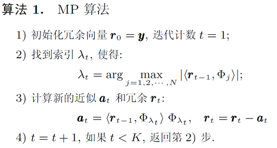
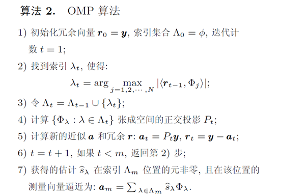
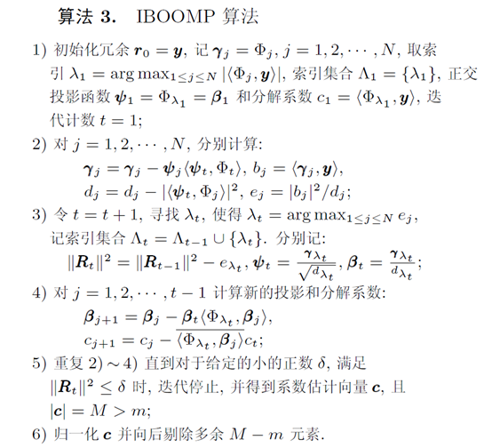
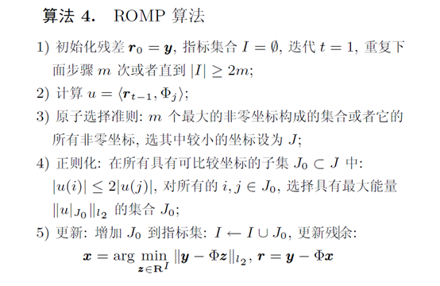
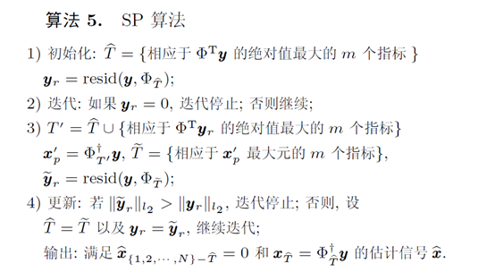
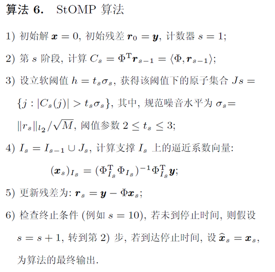
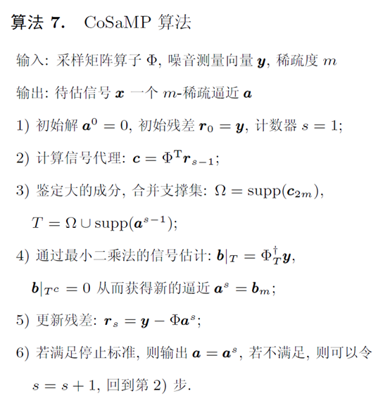

# 稀疏基整理
{: id="20210507101547-wjuwr2q" updated="20210507154524"}

## 傅里叶相关变换基
{: id="20210507101815-o0kwwrw" updated="20210507132935"}

### 离散傅里叶变换 DFT
{: id="20210507103748-g9jf5ju" updated="20210507132537"}

DFT定义
{: id="20210507132736-7ls6uwt" updated="20210507132742"}

$$
X(k)=\sum_{n=0}^{N-1} x(n) e^{-j \frac{2 \pi}{N} k n}=\sum_{n=0}^{N-1} x(n) W_{N}^{k n}
$$
{: id="20210507104152-6q13xp9" updated="20210507105456"}

矩阵表示：
{: id="20210507102424-s7t8bqw" updated="20210507132402"}

$$
\left[\begin{array}{c}
X(0) \\
X(1) \\
X(2) \\
\vdots \\
X(N-1)
\end{array}\right]=\left[\begin{array}{cccc}
1 & 1 & 1 & \cdots & 1  \\
1 & W_{N}^{1} & W_{N}^{2} & \cdots & W_{N}^{N-1}  \\
1 & W_{N}^{2} & W_{N}^{4} & \cdots & W_{N}^{2(N-1)}  \\
\vdots & \vdots & \vdots & \ddots & \vdots  \\
1 & W_{N}^{N-1} & W_{N}^{2(N-1)} & \cdots & W_{N}^{(N-1)(N-1)}
\end{array}\right]
\left[\begin{array}{c}
x(0) \\
x(1) \\
x(2) \\
\vdots \\
x(N-1)
\end{array}\right]
$$
{: id="20210507110129-nvfqorr" updated="20210507110131"}

归一化得基：
{: id="20210507132408-uyuddt1" updated="20210507132949"}

$$
P=\frac{1}{\sqrt{N}}\left[\begin{array}{ccccc}
1 & 1 & 1 & \cdots & 1 \\
1 & W_{N}^{1} & W_{N}^{2} & \cdots & W_{N}^{N-1} \\
1 & W_{N}^{2} & W_{N}^{4} & \cdots & W_{N}^{2(N-1)} \\
\vdots & \vdots & \vdots & \ddots & \vdots \\
1 & W_{N}^{N-1} & W_{N}^{2(N-1)} & \cdots & W_{N}^{(N-1)(N-1)}
\end{array}\right]
$$
{: id="20210507132417-o673tpl" updated="20210507132418"}

Matlab实现：
{: id="20210507132353-28u0g9j" updated="20210507132408"}

```matlab
dftmtx(N)/sqrt(N)
```
{: id="20210507105657-xg1bz7r" updated="20210507105659"}

{: id="20210507132958-azsch47"}

### 快速傅里叶变换 FFT
{: id="20210507132406-98cpeg0" updated="20210507133002"}

使用库利-图基等算法简化DFT计算
{: id="20210507132751-todbqrd" updated="20210507133327"}

Matlab实现：
{: id="20210507133329-s0320l4" updated="20210507133335"}

```matlab
fft(eye(N))/sqrt(N)
```
{: id="20210507133335-d6cgwny" updated="20210507133337"}

{: id="20210507133421-dvt76hn"}

### 离散余弦变换 DCT
{: id="20210507133401-593fuof" updated="20210507135405"}

类似于DFT，但仅使用实数
{: id="20210507140245-qid05cu" updated="20210507140308"}

DCT定义
{: id="20210507135405-2bakhy7" updated="20210507135501"}

$$
f_m =\sqrt{\frac{2}{n}} \sum_{k=0}^{n-1} x_k \cos \left[\frac{\pi}{n} m \left(k+\frac{1}{2}\right) \right]
$$
{: id="20210507135501-tk32ygt" updated="20210507135502"}

Matlab实现：
{: id="20210507135515-q17sol7" updated="20210507135912"}

```matlab
dctmtx(N)
```
{: id="20210507135912-1c9wfi4" updated="20210507135915"}

{: id="20210507152827-env05lb"}

### 离散沃尔什-哈达玛变换 DHT
{: id="20210507144149-p47cv8g" updated="20210507152827"}

DHT与尺度为2的DFT事实等价
{: id="20210507150349-i272nga" updated="20210507150432"}

其变换基可由下式递归推导：
{: id="20210507145343-2npcck2" updated="20210507145428"}

$$
H_1 = \frac{1}{\sqrt2} \begin{pmatrix} 1 & 1 \\1 & -1 \end{pmatrix}
$$
{: id="20210507145428-lw05ij3" updated="20210507150123"}

$$
H_m = \frac{1}{\sqrt2} \begin{pmatrix} H_{m-1} & H_{m-1} \\ H_{m-1} & -H_{m-1} \end{pmatrix}
$$
{: id="20210507150246-2koaiyh" updated="20210507150248"}

{: id="20210507150342-a3w73om"}

## 小波相关变换基
{: id="20210507152846-rensg90" updated="20210507152855"}

### 离散小波变换 DWT
{: id="20210507135924-hj3hot8" updated="20210507152846"}

使用不同的小波的平移和变换来匹配波形
{: id="20210507141348-xgi8456" updated="20210507141950"}

常用小波有 Haar小波、多贝西小波等
{: id="20210507141953-wjo4u9j" updated="20210507142040"}

Matlab实现：
{: id="20210507142041-yprc9tz" updated="20210507142047"}

```matlab
dwt(x,wname)
% wname为使用的小波种类
```
{: id="20210507142047-i1elo84" updated="20210507142103"}

{: id="20210507142152-9xwt15f"}

### 啁啾变换 Chirplet transform
{: id="20210507142704-vob2sb6" updated="20210507143216"}

与波不同，啁啾为频率随时间变化的信号
{: id="20210507142702-4lk4ikh" updated="20210507142949"}

[Matlab实现](https://www.mathworks.com/matlabcentral/fileexchange/72303-chirplet-transform?s_tid=srchtitle)
{: id="20210507142910-5tp9ndv" updated="20210507203120"}

> Steve Mann, Simon Haykin,[ The Chirplet Transform: Physical Considerations](https://ieeexplore.ieee.org/document/482123), IEEE TRANSACTIONS ON SIGNAL PROCESSING,VOL. 43, NO. 11, NOVEMBER 1995
> {: id="20210507154923-4h68zrj" updated="20210507155144"}
{: id="20210507154922-32d8g4b" updated="20210507154923"}

{: id="20210507143201-1lk9yh8"}

### 曲波变换 Curvelet transform
{: id="20210507143159-vqodv03" updated="20210507144056"}

与小波不同，曲线波具有方向性，多分辨率等特性。
{: id="20210507143847-8psc44o" updated="20210507144003"}

[Matlab实现1](http://www.curvelet.org/download.html)            [介绍](https://blog.csdn.net/u014593748/article/details/68127499?ops_request_misc=%257B%2522request%255Fid%2522%253A%2522162036932116780255262696%2522%252C%2522scm%2522%253A%252220140713.130102334.pc%255Fall.%2522%257D&request_id=162036932116780255262696&biz_id=0&utm_medium=distribute.pc_search_result.none-task-blog-2~all~first_rank_v2~rank_v29-3-68127499.pc_search_result_cache&utm_term=Curvelet&spm=1018.2226.3001.4187)
{: id="20210507144010-lspul0q" updated="20210507203215"}

[Matlab实现2
{: id="20210507144138-hiyevx6" updated="20210507144153"}

](https://www.mathworks.com/matlabcentral/fileexchange/31559-ridgelet-and-curvelet-first-generation-toolbox?s_tid=srchtitle)
{: id="20210507144138-hiyevx6" updated="20210507144153"}

{: id="20210507153434-53hdo34"}

除上述方法外还有诸如Bandlet， Contourlet等变换
{: id="20210507153433-a3xtak0" updated="20210507153524"}

{: id="20210507153526-d1y1kqv"}

## 其它方法
{: id="20210507145328-k5zbi65" updated="20210507152910"}

### 学习字典 Learning Dictionary
{: id="20210507152911-dt8ftme" updated="20210507152952"}

给定字典$D=[d_1,d_2,...,d_K]\in \mathbb{R}^{n\times K}$，使得信号$X=[x_1,x_2,...,x_n]\in \mathbb{R}^{n\times N}$可被表示为
{: id="20210507152945-sj5cztw" updated="20210422095911"}

$$
X\approx DA
$$
{: id="20210507152945-acowtc0" updated="20210422095913"}

其中$A=[\alpha_1,\alpha_2,...,\alpha_N]\in \mathbb{R}^{K\times N}$ 为$X$在$D$下的表示系数，当$\alpha_i$中非零元素远小于$K$时，则称该向量为稀疏的。
{: id="20210507152945-haefh4e" updated="20210422100247"}

则字典学习优化问题可表示为：
{: id="20210507152945-g2m7wsk" updated="20210422100350"}

$$
\min _{D, A}\left\{\|X-D A\|_{F}^{2}+\lambda_{A} g_{A}(A)\right\}
$$
{: id="20210507152945-4sjruea" updated="20210422100352"}

其中$g_A()$为求稀疏度函数，$\lambda_A$为归一化参数。
{: id="20210507152945-etq87on" updated="20210422100455"}

常见字典学习算法：
{: id="20210507152945-rpbpc47" updated="20210507205429"}

| 算法      | 主要思想                               |
| ----------- | ---------------------------------------- |
| Sparsenet | 最大似然估计                           |
| MOD       | $l_o$范数衡量稀疏性<br />最小均方误差    |
| K-SVD     | 正交匹配追踪(OMP)<br />奇异值分解(SVD) |
| ODL       | 每次迭代仅处理一个样本                 |
{: id="20210507152945-ic5ldk7" updated="20210422100543"}

{: id="20210507154906-hgnqsj2"}

> 练秋生, 石保顺, 陈书贞. [字典学习模型、算法及其应用研究进展](http://www.aas.net.cn/fileZDHXB/journal/article/zdhxb/2015/2/PDF/2015-2-240.pdf). 自动化学报, 2015, 41(2): 240−260
> {: id="20210507154840-vwt4yjf" updated="20210507154859"}
{: id="20210507154532-ddhqxry" updated="20210507154840"}

{: id="20210507154912-w3tgr7w"}

# 重构算法整理
{: id="20210507152949-l5qwt1t" updated="20210507154539"}

## 贪婪算法
{: id="20210507154204-mt6fs4t" updated="20210507154213"}

追求局部最优，计算速度较快。
{: id="20210507204245-blj2gae" updated="20210507205249"}

{: id="20210507205256-vmx3yfx"}

### 匹配追踪算法 MP
{: id="20210507154649-6pu3n18" updated="20210507155244"}


{: id="20210507221012-sooorec" updated="20210507221013"}

从字典矩阵D（也称为过完备原子库中），选择一个与信号 y 最匹配的原子(也就是某列)，构建一个稀疏逼近，并求出信号残差，然后继续选择与信号残差最匹配的原子，反复迭代，信号y可以由这些原子的线性和，再加上最后的残差值来表示。很显然，如果残差值在可以忽略的范围内，则信号y就是这些原子的线性组合。
{: id="20210507162933-1hnsr5q"}

{: id="20210507220148-9k0on3f"}

### 正交匹配追踪算法 OMP
{: id="20210507155245-tayf673" updated="20210507171917"}


{: id="20210507221030-eqtlh7v" updated="20210507221031"}

OMP算法是在 MP 算法的基础上进行改进的，其挑选原子的标准和 MP 算法一致，也就是在训练字典A里挑选和测试样本x最为匹配的字典原子。不相同之处在于：OMP 算法在每一次迭代过程中对所挑选的全部原子先要执行 Schmidt 正交化操作，来确保每一次循环结果都是最优解。使得在同等精度的条件下，OMP 算法的性能更好，其收敛速度也更快。
{: id="20210507164721-8rnubud" updated="20210507164740"}

OMP每次迭代均只选择与残差最相关的一列。
{: id="20210507164721-xhuv173" updated="20210507215844"}

> [压缩感知——浅析匹配追踪算法（Matching Pursuit，MP）与正交匹配追踪算法（Orthogonal Matching Pursuit，OMP）](https://blog.csdn.net/ikhui7/article/details/103673013)
> {: id="20210507165440-05nj915" updated="20210507165643"}
{: id="20210507165440-were82x"}

OMP 与MP 的共同缺点在于原子选择机制相对于新的冗余误差的非最优性, 也就是说待选原子一旦进入支撑候选中, 则永久添加不会再被删除, 缺少“回溯”的思想. 这里“回溯”表示在当前迭代的步骤中, 仍对上次迭代中所入选的原子进行同步检验, 如果仍然满足当次最优意义则保留, 否则剔除作为下次待选. 其意义在于它可以最大程度保证重建的全局最优性, 因为在某次迭代中达到贪婪条件的原子并不能保证在以后迭代步骤中仍能达到, 所有原子都应做到“删除”和“添加”自由, 这种思想在后续产生的多种贪婪算法中得到了广泛的应用.
{: id="20210507215854-7711yf8" updated="20210507215854"}

{: id="20210507220153-3cyt4kx"}

### 后退型最优正交匹配 IBOOMP.
{: id="20210507220152-xe95dmf" updated="20210507221048"}


{: id="20210507221048-sukhg2j" updated="20210507221050"}

针对OMP中原子选择机制的缺点并引入简单的“回溯”思想,提出IBOOMP 算法。模拟实验证明: IBOOMP 算法在相对误差一定的条件下较大程度地减少了重建对测量次数的要求,但是它与MP 及OMP 具有相同的最优原子选择机制, 每次迭代只选择一个原子, 为进一步提高重建速度及重建精度, 一次迭代选择多个原子的思想被采用到贪婪算法中.
{: id="20210507220312-s36ggps" updated="20210507221117"}

> 方红,章权兵,韦穗.[改进的后退型最优正交匹配追踪图像重建方法](https://kns.cnki.net/kcms/detail/detail.aspx?dbcode=CJFD&dbname=CJFD2008&filename=HNLG200808006&v=%25mmd2FDU%25mmd2B%25mmd2FALPY8vu%25mmd2Fo5P6dNxDcDBlmnh2f0wlau2XI95EM%25mmd2FcNYoD1rmIUZbEAY%25mmd2FsRVP3)[J].华南理工大学学报(自然科学版),2008(08):23-27.
> {: id="20210507220201-td5xvd5" updated="20210507220232"}
{: id="20210507220159-vr0ptrv" updated="20210507220201"}

{: id="20210507215829-ckldfqf"}

### 正则正交匹配追踪算法 ROMP
{: id="20210507155321-9mb969u" updated="20210507155330"}


{: id="20210507221143-l674uha" updated="20210507221144"}

MP与OMP受矩阵列向量间相关性影响较大，而ROMP 算法可以通过选择替代信号的最大元素并采用正则化的方式来确保没有太多的错误元素被选择，在每次迭代的过程中可以选多几个原子，ROMP算法比 OMP 算法更快速且重构结果更加均衡稳定。
{: id="20210507165655-vc53k8l" updated="20210507204446"}

[Matlab实现](https://blog.csdn.net/xiaoma_xiaoma/article/details/67005296)
{: id="20210507203432-8jdzhdb" updated="20210507203440"}

> D. Needell and R. Vershynin, "[Signal Recovery From Incomplete and Inaccurate Measurements Via Regularized Orthogonal Matching Pursuit,](https://ieeexplore.ieee.org/document/5419092)" in *IEEE Journal of Selected Topics in Signal Processing* , vol. 4, no. 2, pp. 310-316, April 2010, doi: 10.1109/JSTSP.2010.2042412.
> {: id="20210507170016-skjljwu" updated="20210507170028"}
{: id="20210507170014-6xr10db" updated="20210507170016"}

{: id="20210507220843-3eh64wz"}

### 子空间追踪 SP
{: id="20210507172522-ui5k5yi" updated="20210507204616"}


{: id="20210507221150-ikxe4r3" updated="20210507221152"}

ROMP 和SP 具有相同的原子选择机制, 每次迭代都以$φ^Ty_r$(Tyr表示当前冗余) 中前 m 个绝对值最大的非零坐标所对应的原子作为候选; 其中,ROMP 利用正则化的方法找出候选原子集合中能量最大的原子集合$J_0%$, 在所有支撑集为$J_0$ 的稀疏信号中利用最小二乘法找出使得$||y-φx||_{l_2}$最小的解x作为当前估计, 并以$y -φx$作为残差更新公式, 没有”回溯” 的思想, 每次迭代都在一个“可靠” 候选集中选择出满足正则条件的原子添加到上次迭代中, 并且这些原子一直保持到迭代停止. SP与ROMP 在残差更新方式上则不同, 它以相邻两次迭代冗余的差作为迭代停止条件, 每次迭代中在当次迭代支撑和前次迭代支撑集合的并集( $T’$)上利用最小二乘求出当前估计$x=  y$, 可见SP采用了“回溯”思想, 与ROMP相比更好地保证了重建的最优性.
{: id="20210507203753-jvhsi4p" updated="20210507220738"}

[Matlab实现](https://blog.csdn.net/weixin_30576827/article/details/97729025)
{: id="20210507204058-1i3cpl4" updated="20210507204104"}

> Dai W, Milenkovic O. [Subspace pursuit for compressive sensing signal reconstruction](https://arxiv.org/pdf/0803.0811)[J]. IEEE transactions on Information Theory, 2009, 55(5): 2230-2249.
> {: id="20210507203844-7yep41v" updated="20210507203924"}
{: id="20210507203841-kwezvf6" updated="20210507203844"}

{: id="20210507204501-1i461pu"}

### 逐步正交匹配追踪 StOMP
{: id="20210507173251-fiahf0o" updated="20210507201619"}


{: id="20210507221312-53ks6up" updated="20210507221313"}

StOMP算法也是基于OMP进行改进的，每次迭代可以选择多个原子。但它的输入参数没有信号稀疏度K，因此跟ROMP和CoSaMP有自己的优势。
{: id="20210507201621-7zbr7a9" updated="20210507202635"}

[Matlab实现](https://blog.csdn.net/jbb0523/article/details/45441601)
{: id="20210507205355-zumyo2z" updated="20210507205401"}

> Donoho D L, Tsaig Y, Drori I, et al. [Sparse solution of underdetermined linear equations by stagewise orthogonal matching pursuit, submitted to](https://statistics.stanford.edu/sites/g/files/sbiybj6031/f/2006-02.pdf)[C]//IEEE Trans. on Information theory. 2006.
> {: id="20210507202640-b2qwe45" updated="20210507221300"}
{: id="20210507201621-yypv043" updated="20210507202640"}

{: id="20210507202839-7k8rv55"}

### 压缩感知匹配追踪 CoSaMP
{: id="20210507173251-i0abnvm" updated="20210507173753"}


{: id="20210507221338-y0gqlru" updated="20210507221338"}

CoSaMP也是对OMP的一种改进，每次迭代选择多个原子，除了原子的选择标准之外，它有一点不同于ROMP：
ROMP每次迭代已经选择的原子会一直保留，而CoSaMP每次迭代选择的原子在下次迭代中可能会被抛弃。
{: id="20210507173604-f78mn2z" updated="20210507221409"}

> Needell D, Tropp J A. CoSaMP: [Iterative signal recovery from incomplete and inaccurate samples](https://www.sciencedirect.com/science/article/pii/S1063520308000638/pdf?md5=36bc2c5ba3a3c2998d9f353469f90c43&pid=1-s2.0-S1063520308000638-main.pdf)[J]. Applied and computational harmonic analysis, 2009, 26(3): 301-321.
> {: id="20210507173802-626kgip" updated="20210507173854"}
{: id="20210507173801-09378f6" updated="20210507173802"}

{: id="20210507203728-ko4116o"}

### 分段弱正交匹配追踪 SWOMP
{: id="20210507201536-zoiw4sz" updated="20210507204514"}

SWOMP可以说是StOMP的一种改进算法，它们的唯一不同是选择原子时的门限设置，这可以降低对测量矩阵的要求。我们称这里的原子选择方式为“弱选择”。
{: id="20210507204515-3chyzlm" updated="20210507204604"}

[Matlab实现](https://blog.csdn.net/jbb0523/article/details/45675735)
{: id="20210507204622-x7b3uwc" updated="20210507204637"}

> Blumensath T, Davies M E. [Stagewise weak gradient pursuits](https://www.pure.ed.ac.uk/ws/portalfiles/portal/17821349/BD_SWGP.pdf)[J]. IEEE Transactions on Signal Processing, 2009, 57(11): 4333-4346.
> {: id="20210507204607-eidd0p2" updated="20210507204912"}
{: id="20210507204604-07fbw70" updated="20210507204607"}

{: id="20210507220906-gj5pgxj"}

### 广义正交匹配追踪 GOMP
{: id="20210507201620-4ahsydz" updated="20210507202848"}

GOMP可视为OMP算法的推广，OMP每次只选择与残差相关最大的一个，而GOMP则是简单地选择最大的S个。
{: id="20210507202851-xxzy1po" updated="20210507202942"}

[Matlab实现](https://blog.csdn.net/yuehuihui00/article/details/78327119)
{: id="20210507203333-xqluydr" updated="20210507203346"}

> Wang J, Kwon S, Shim B. [Generalized orthogonal matching pursuit](https://arxiv.org/pdf/1111.6664)[J]. IEEE Transactions on signal processing, 2012, 60(12): 6202-6216.
> {: id="20210507203251-zhfbblq" updated="20210507203302"}
{: id="20210507202851-7s36pnq" updated="20210507203251"}

{: id="20210507220856-ngroevx"}

### 稀疏度自适应匹配追踪 SAMP
{: id="20210507155331-ckqcptn" updated="20210507172521"}

SAMP提出了一种不需要输入稀疏度K的算法，通过设置步长（很大程度影响速度、小程度影响精度）和合适的停止条件（很大程度影响精度）来进行稀疏度的估计和支撑集的填充。
{: id="20210507173105-ipmiynf"}

[Matlab实现](https://blog.csdn.net/yuehuihui00/article/details/78327079)
{: id="20210507205007-tyki88u" updated="20210507205013"}

> Do T T, Gan L, Nguyen N, et al. [Sparsity adaptive matching pursuit algorithm for practical compressed sensing](https://apps.dtic.mil/sti/pdfs/ADA528509.pdf)[C]//2008 42nd Asilomar conference on signals, systems and computers. IEEE, 2008: 581-587.
> {: id="20210507173108-a39sson" updated="20210507173135"}
{: id="20210507173106-0stz4gv" updated="20210507173108"}

{: id="20210507204505-sy0aa8i"}

## 凸松弛类算法
{: id="20210507154213-7f7r72u" updated="20210507210235"}

稀疏表征模型在将 $l_0$ 范数替换为 $l_1$ 范数后约束优化问题形式：
{: id="20210507161024-ciqykya" updated="20210507205848"}

$$
\min_x ||x||_1 \ \  s.t. ||y-\Phi x||_2<\sigma
$$
{: id="20210507160337-p97s4fh" updated="20210507160614"}

非约束优化问题形式：
{: id="20210507161054-a6is91i" updated="20210507161108"}

$$
\min_x  ||y-\Phi x||_2+\lambda||x||_1
$$
{: id="20210507161109-18chfa0" updated="20210507161143"}

Candes，Tao 和 Donoho 等人已证明，当测量矩阵 Φ 满足约束等距性质( Restricted IsometryProperty，RIP) 时，组合优化问题( $l_0$ 优化问题) 可转化为数值上容易处理 $l_1$ 约束的凸优化问题
{: id="20210507155519-zfj5uni" updated="20210507210316"}

> 李珅, 马彩文, 李艳, 等. [压缩感知重构算法综述](https://www.cnki.com.cn/Article/CJFDTotal-HWYJ2013S1044.htm)[D]. , 2013.
> {: id="20210507160255-arq8pvd" updated="20210507210053"}
{: id="20210507155519-zfj5uni" updated="20210507160255"}

{: id="20210507205301-7i4e3a8"}

### 基追踪算法
{: id="20210507205241-2yiod4p" updated="20210507210003"}

$l_1$ 范数约束优化问题等价于下面的线性规划问题：
{: id="20210507210422-ha95oo0" updated="20210507210814"}

$$
\min c^{\mathrm{T}}x \quad Ax = b, \; x \geq 0
$$
{: id="20210507210422-do0gd63" updated="20210507210424"}

[Matlab实现](https://blog.csdn.net/theonegis/article/details/78268737)
{: id="20210507210021-pqr7aii" updated="20210507210750"}

> Chen S S, Donoho D L, Saunders M A.[ Atomic decomposition by basis pursuit](http://citeseerx.ist.psu.edu/viewdoc/download?doi=10.1.1.37.4272&rep=rep1&type=pdf)[J]. SIAM review, 2001, 43(1): 129-159.
> {: id="20210507210005-9woqkku" updated="20210507210017"}
{: id="20210507210003-mhnp891" updated="20210507210005"}

{: id="20210507210853-ui6rjm8"}

### 迭代加权最小二乘法 IRLS
{: id="20210507205241-ih86us3" updated="20210507212034"}

核心思想是通过将L0-norm松弛化（relaxation），把高度不连续的问题松弛化为连续的甚至是光滑逼近（smooth approximation）。
{: id="20210507211041-isa4b7y"}

> Gorodnitsky I F, Rao B D. [Sparse signal reconstruction from limited data using FOCUSS: A re-weighted minimum norm algorithm](http://citeseerx.ist.psu.edu/viewdoc/download?doi=10.1.1.377.4301&rep=rep1&type=pdf)[J]. IEEE Transactions on signal processing, 1997, 45(3): 600-616.
> {: id="20210507211455-hbdys9b" updated="20210507211508"}
>
> [详解](https://blog.csdn.net/maum61/article/details/87019858)
> {: id="20210507212410-wdi9019" updated="20210507212418"}
{: id="20210507211454-dpouyi9" updated="20210507211455"}

{: id="20210507211535-rd3i8d4" updated="20210507212910"}

### 迭代硬/软阈值算法 IHT/IST、二步迭代软阈值算法TwIST
{: id="20210507212905-0nhgjhd" updated="20210507214623"}

其核心思想均为[Majorization-Minimization思想](https://blog.csdn.net/jbb0523/article/details/52134630)，使用一个易优化的函数在一定条件下无限逼近原函数的最优解。
{: id="20210507213254-wswauer" updated="20210507214315"}

IHT使用硬阈值函数，IST使用软阈值函数，TwIST为改进的IST，收敛速度更快
{: id="20210507214036-5mf569c" updated="20210507214257"}

[IST的Matlab实现](https://blog.csdn.net/yuehuihui00/article/details/99877808)
{: id="20210507214259-uj1iehm" updated="20210507214339"}

[TwIST的Matlab实现](https://blog.csdn.net/jbb0523/article/details/52193209)
{: id="20210507214342-1f3belv" updated="20210507214400"}

> Blumensath T, Davies M E. [Iterative hard thresholding for compressed sensing](https://www.sciencedirect.com/science/article/pii/S1063520309000384/pdf?md5=eeeede2b5b88fdcae6120aa9a9a97086&pid=1-s2.0-S1063520309000384-main.pdf&_valck=1)[J]. Applied and computational harmonic analysis, 2009, 27(3): 265-274.
> {: id="20210507214516-xrb6oqq" updated="20210507214525"}
>
> Bredies K, Lorenz D. [Iterative soft-thresholding converges linearly](https://citeseerx.ist.psu.edu/viewdoc/download?doi=10.1.1.245.1143&rep=rep1&type=pdf)[R]. Zentrum für Technomathematik, 2007.
> {: id="20210507214527-fjg1za8" updated="20210507214609"}
>
> Bioucas-Dias J M, Figueiredo M A T. [A new TwIST: Two-step iterative shrinkage/thresholding algorithms for image restoration](https://citeseerx.ist.psu.edu/viewdoc/download?doi=10.1.1.142.2686&rep=rep1&type=pdf)[J]. IEEE Transactions on Image processing, 2007, 16(12): 2992-3004.
> {: id="20210507214611-o073pdi" updated="20210507214715"}
{: id="20210507214402-uvderxr" updated="20210507214516"}

其它迭代阈值算法：
{: id="20210507215415-p261m3v" updated="20210507215559"}

> Yuan X T ,  Li P ,
> Zhang T . [Gradient hard thresholding pursuit](https://www.jmlr.org/papers/volume18/14-415/14-415.pdf)[J]. Journal of Machine
> Learning Research, 2018, 18:1-43.
> {: id="20210507215418-4t4zxuv" updated="20210507215500"}
>
> 杨海蓉, 方红, 张成,等. [基于回溯的迭代硬阈值算法](http://www.aas.net.cn/fileZDHXB/journal/article/zdhxb/2011/3/PDF/110303.pdf)[J]. 自动化学报, 2011(03):276-282.(Yang H R
> ,  Fang H ,  Zhang C , et al. Iterative Hard Thresholding
> Algorithm Based on Backtracking[J]. Acta Automatica Sinica, 2011,
> 37(3):276-282.)
> {: id="20210507215418-e0xfhcy" updated="20210507215519"}
>
> Bahmani, Sohail, Raj,
> et al. [Greedy Sparsity-Constrained Optimization](https://www.jmlr.org/papers/volume14/bahmani13a/bahmani13a.pdf).[J]. Journal of Machine
> Learning Research, 2013.
> {: id="20210507215418-j37op55" updated="20210507215539"}
>
> 杨立波, 蒋铁钢, 徐志强. [基于混合梯度的硬阈值追踪算法](http://www.joca.cn/CN/article/downloadArticleFile.do?attachType=PDF&id=23467)[J]. 计算机应用, 2020,
> v.40;No.355(03):298-302.
> {: id="20210507215418-1xztjlw" updated="20210507215618"}
{: id="20210507215415-dykpul4" updated="20210507215417"}

{: id="20210507205240-vcbuq66"}

## 其它算法
{: id="20210507154234-q5a9r8d" updated="20210507214804"}

### 稀疏贝叶斯算法 MSBL
{: id="20210507154348-y7mwmmi" updated="20210507215055"}

根据信号稀疏先验特性，将非线性优化问题转化为带有稀疏约束的线性回归问题的稀疏贝叶斯算法(MSBL)，因其具有更高的重构精度被越来越多地用于压缩感知重构中。
{: id="20210507214956-jy6dp2e" updated="20210507215051"}

> Wipf D P, Rao B D. [An empirical Bayesian strategy for solving the simultaneous sparse approximation problem](https://www.microsoft.com/en-us/research/wp-content/uploads/2016/07/04244754.pdf)[J]. IEEE Transactions on Signal Processing, 2007, 55(7): 3704-3716.
> {: id="20210507214958-p3m5vc7" updated="20210507215015"}
{: id="20210507170429-g0i1ukh" updated="20210507214958"}

{: id="20210507215016-zvark6m"}


{: id="20210507101547-jh3uxg3" type="doc"}
